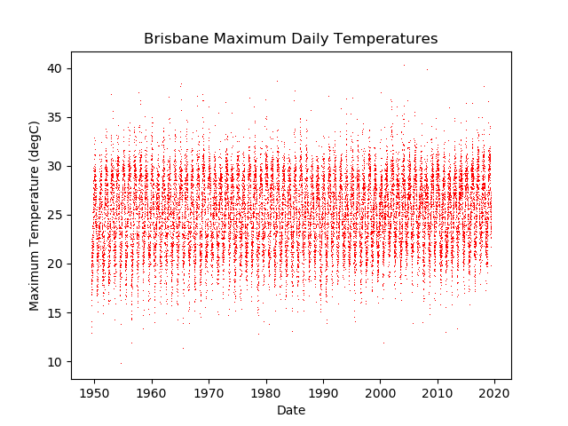
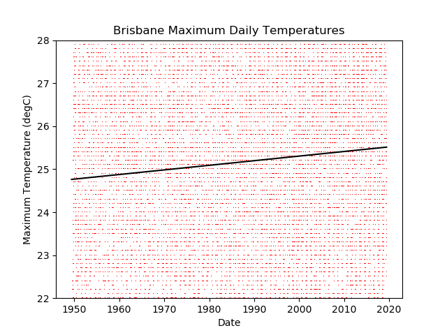
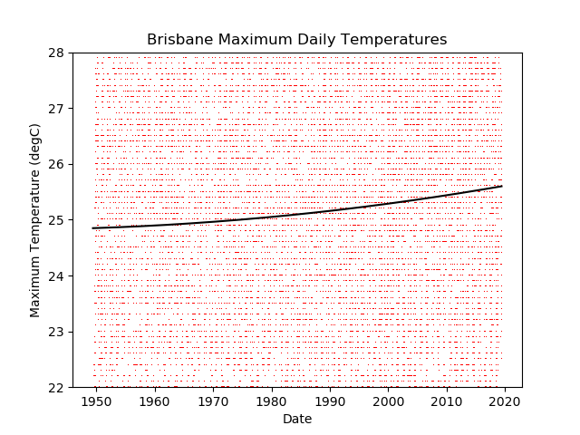

# Temperature Changes In Brisbane

We are investigating the temperature changes in Brisbane over the past years.  We are not trying to prove *global* climate change.  We are also not trying to explain *why* any changes occurred.  We are simply exploring the temperature data for Brisbane.

## Data Source:

We got the data from: bom.gov.au/climate/data/acorn-sat on Monday 2 March 2020.  This is a daily data series, starting on 4 June 1949 and ending on 31 May 2019: almost 71 years.

## Raw Data Visualisation:

This is what our data looks like: 

## Fitting a straight line:

If we fit a straight line to the data we can see if the general trend is increasing or decreasing. 
The following graph shows that over the past 71 years, the temperature at Brisbane airport has most likely increased.  
At this stage we cannot really say "it has definitely increased by 0.75 degC" because there is a lot of scatter in the temperature data.  
But it certainly looks like Brisbane airport has got hotter.

## Fitting a quadratic to the graph

If we fit a quadratic to the data we can see if the general trend is increasing or decreasing. 
The following graph shows that over the past 71 years, the temperature at Brisbane airport has most likely increased.  
At this stage we cannot really say "it has definitely increased by 0.75" Deg C because there is a lot of scatter in the temperature data.  
But it certainly looks like Brisbane airport has got hotter.

